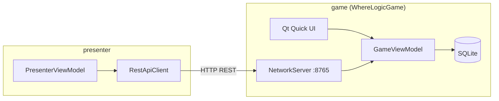

# WhereLogic

WhereLogic — семейная настольная викторина с локальным игровым экраном (Qt Quick) и мобильным пультом ведущего. Проект разделён на три qmake-подпроекта: игра, пульт и модульные тесты.

## Архитектура

```
WhereLogic/
├── game/                 # Основное приложение (экран телевизора / планшета)
│   ├── src/
│   │   ├── core/         # Константы, политики раскрытия раундов
│   │   ├── models/       # БД, сеть, AI/OpenCV-заглушки
│   │   └── viewmodels/   # GameViewModel, AdminViewModel
│   └── qml/              # UI: экраны, компоненты, раскладки
├── presenter/            # Мобильный пульт (REST-клиент)
│   ├── src/
│   └── qml/
├── shared/api/           # Общие REST-константы
├── config/               # Манифесты AI, OpenCV, deps_manifest.json
├── scripts/              # fetch_ai_deps.py
├── tools/WhereLogicSetup/  # QML-утилита загрузки зависимостей
├── external/             # Отдельные репозитории (OpenCV и др.)
│   └── WhereLogicOpenCV/ # git clone / submodule
├── third_party/          # .pri-интеграции (whisper, opencv.pri)
└── tests/                # Qt Test
```

### Поток данных



| Компонент | Назначение |
|-----------|------------|
| `DatabaseManager` | SQLite: пресеты, раунды, загадки, локализация, состояние сессии |
| `GameViewModel` | Состояние игры, таймер, очки, стадии (`STAGE_*`) |
| `NetworkServer` | `QHttpServer`: PIN-авторизация, heartbeat, puzzle payload, действия пульта |
| `AdminViewModel` | Выбор пресета игры в оверлее настроек |
| `PresenterViewModel` | Состояние подключения пульта, опрос `/current_puzzle` |
| `RoundRevealPolicy` | Поведение экрана «чего не хватало» по типу раскладки |

### Стадии игры (QML)

| `currentStage` | Экран |
|----------------|-------|
| `STAGE_WELCOME` | `WelcomeScreen` |
| `STAGE_TEAM_SETUP` | `TeamSetupScreen` |
| `STAGE_CLOSED_CARDS`, `STAGE_MAIN_TURN`, … | `UniversalGameField` + раскладка |
| `STAGE_MISSING_REVEAL` | `MissingRevealOverlay` |
| `STAGE_INTER_ROUND` | `InterRoundScreen` |
| `STAGE_FINAL_VICTORY` | `FinalVictoryScreen` |

Настройки (PIN, админ) — оверлей в `MainContainer` (тап в правый верхний угол).

## Требования

- **Qt 6.5+** с модулями: `quick`, `sql`, `network`, `multimedia`, `concurrent`
- **Qt HttpServer** (`qthttpserver`) — **обязателен** для REST API пульта (`QHttpServer` в `NetworkServer`)
- Компилятор с поддержкой **C++17**
- **OpenCV** и **whisper.cpp** — опционально; по умолчанию сборка без них (`CONFIG+=no_opencv no_whisper`)

## Сборка

Рекомендуемая схема с отдельной папкой сборки:

```bash
mkdir build
cd build
qmake ../WhereLogic.pro CONFIG+=release
mingw32-make
```

**OpenCV (MinGW)** подтягивается автоматически: при первом `qmake` или `Build` в Qt Creator собирается подпроект `opencv_external` (~15 мин, один раз). Дальше — только проверка stamp-файла. Принудительная пересборка: `CONFIG+=rebuild_opencv`. Отключить: `CONFIG+=no_opencv`.

После смены `WhereLogic.pro` / `opencv.pri` выполните **Build → Run qmake** в Qt Creator (или `qmake` в каталоге сборки).

На Linux/macOS вместо `mingw32-make` используйте `make -j$(nproc)`.

### Цели

| Цель | Описание |
|------|----------|
| `WhereLogicGame` | Игровой экран (`game/`) |
| `WhereLogicPresenter` | Пульт (`presenter/`) |
| `WhereLogicSetup` | Загрузчик зависимостей (`tools/WhereLogicSetup/`) |
| `tst_*` | Модульные тесты (`tests/`) |

Запуск тестов:

```bash
cd build/tests/tst_databasemanager && ./tst_databasemanager
# … или ctest, если настроен
```

### Опциональные зависимости (AI, OpenCV, HttpServer)

Единый манифест: `config/deps_manifest.json`.

#### Вариант A — QML-утилита с прогрессом (рекомендуется)

Соберите `WhereLogicSetup` вместе с проектом или отдельно:

```bash
qmake tools/WhereLogicSetup/WhereLogicSetup.pro
mingw32-make
```

Запустите `WhereLogicSetup.exe` — отметьте компоненты, нажмите **Скачать выбранное** или **Скачать всё**. Прогресс по каждому файлу и общий — в окне.

#### Вариант B — Python (терминал / CI)

Требуется Python 3.10+ и `git` в PATH:

```bash
python scripts/fetch_ai_deps.py --list
python scripts/fetch_ai_deps.py --group whisper
python scripts/fetch_ai_deps.py --all
```

#### Что качается автоматически

| Компонент | Куда | Примечание |
|-----------|------|------------|
| whisper.cpp | `third_party/whisper.cpp` | `git clone` |
| ggml-tiny.bin | `build/models/` | ~75 МБ |
| OpenCV 4.10 Windows (MSVC) | `external/WhereLogicOpenCV/prebuilt/x64/msvc/` | Kit **MSVC 64-bit** |
| OpenCV (MinGW) | `external/WhereLogicOpenCV/prebuilt/x64/mingw/` | Сборка **Qt mingw1310_64** |
| Qt HttpServer | — | Только вручную через Qt Maintenance Tool |

| Файл | Условие включения в сборке |
|------|---------------------------|
| `third_party/whisper.pri` | `third_party/whisper.cpp/whisper.h` → `HAS_WHISPER` |
| `third_party/opencv.pri` | Авто: `x64/mingw` (MinGW) или `x64/msvc` (MSVC) → `HAS_OPENCV` + копия DLL |
| `config/ai_manifest.json` | Пути к моделям Whisper |
| `config/opencv_prebuilt.json` | Метаданные prebuilt OpenCV |

Без зависимостей `ImageProcessor` и `VoiceRecognizer` работают в режиме заглушек.

### OpenCV: external `WhereLogicOpenCV`

OpenCV вынесен в отдельный каталог — клонируется отдельно (submodule или свой git clone). **В основной сборке MinGW prebuilt строится сам** через `external/WhereLogicOpenCV/WhereLogicOpenCV.pro` (зависимость `game.depends`).

Ручная сборка (если нужно отдельно):

```powershell
git clone <WhereLogicOpenCV-repo-url> external/WhereLogicOpenCV
cd external/WhereLogicOpenCV
powershell -ExecutionPolicy Bypass -File scripts/build_qt_mingw.ps1
```

Структура после сборки:

```
external/WhereLogicOpenCV/prebuilt/
  include/opencv2/opencv.hpp
  x64/mingw/lib/libopencv_{core,imgproc,imgcodecs}*.dll.a
  x64/mingw/bin/libopencv_*.dll
  x64/msvc/…                           ← MSVC kit (fetch script / Setup)
```

- **MinGW:** только сборка тем же GCC, что и Qt (`C:\Qt\Tools\mingw1310_64`). MSYS2 OpenCV **не использовать** — ABI несовместим.
- **MSVC kit:** `python scripts/fetch_ai_deps.py --id opencv_win_msvc` или WhereLogicSetup.
- Миграция со старого пути: `powershell -File scripts/migrate_opencv_external.ps1`
- После сборки DLL копируются в `game/debug` автоматически (`QMAKE_POST_LINK`).

Без prebuilt проект собирается с `CONFIG+=no_opencv` (заглушка `ImageProcessor`).

### Запуск на другом ПК (без MSYS2 / OpenCV / Qt)

**MSYS2 нужен только на машине разработчика** — чтобы собрать `x64/mingw/lib` в репозитории. На целевом ПК ничего из этого ставить не надо.

Игра ищет DLL **рядом с `WhereLogicGame.exe`**, а не в системе:

| Что | Откуда попадает к exe |
|-----|------------------------|
| OpenCV | `QMAKE_POST_LINK` при сборке + `x64/mingw/bin` |
| Qt / QML | `windeployqt` (скрипт ниже) |
| MinGW runtime | `libgcc_s_seh-1.dll`, `libstdc++-6.dll`, … (скрипт копирует) |

**Сборка переносимой папки** (Release, затем):

```powershell
powershell -ExecutionPolicy Bypass -File scripts/package_portable.ps1
```

Получите `dist/WhereLogicGame-portable/` — **скопируйте целиком** на флешку или другой ПК и запустите `WhereLogicGame.exe`.

**Без OpenCV на целевом ПК — два варианта:**

1. **Собрать без OpenCV** (`no_opencv` в `.pro` или нет `x64/mingw/lib`) — меньше DLL, маски в раунде 5 не работают, зато проще раздавать.
2. **Собрать с OpenCV** — в портативную папку попадут `libopencv_*.dll` (и зависимости вроде `zlib1.dll`); на другом ПК OpenCV **не устанавливается**, только лежит рядом с exe.

База SQLite и настройки (громкость) — в `%AppData%` пользователя на каждом ПК отдельно.

### Локализация и подписи UI

Цепочка приоритетов для любой строки по ключу:

1. **SQLite** — таблица `localization_strings` (сиды при первом запуске)
2. **Файл дефолтов** — `config/ui_defaults_ru.json` (вшит в ресурсы, русский)
3. **Ключ** — если ничего не найдено

В QML: `gameViewModel.label("ui.welcome.title")`. Раунды и подсказки: ключи `round.*`, `puzzle.hint.*` — те же правила через `localizedString()` в C++.

Устаревший PowerShell-скрипт: `scripts/fetch_deps.ps1` (оставлен для совместимости; предпочтительнее Python или Setup).

## REST API (порт 8765)

Общие пути — `shared/api/RestApiConstants.h`:

- `POST /api/auth` — `{ "pin": "ABCDE" }` → `{ "token": "…" }`
- `POST /api/heartbeat` — заголовок `X-Auth-Token`
- `GET /api/current_puzzle` — снимок состояния загадки
- `POST /api/action` — `{ "action": "READY" | "TRANSFER_TURN" | … }`
- `POST /api/submit_text` — `{ "text": "ответ" }`

PIN ротируется каждые 30 с; отображается в оверлее настроек игры.

## Навигация по коду

| Задача | С чего начать |
|--------|----------------|
| Логика раунда | `game/src/viewmodels/GameViewModel.cpp` |
| Схема БД / сиды | `game/src/models/DatabaseManager.cpp` |
| Типы раскладок | `game/src/core/GameConstants.h` → `LayoutType` |
| UI раскладки | `game/qml/components/layouts/*.qml` |
| Пульт | `presenter/qml/main.qml`, `presenter/src/PresenterViewModel.cpp` |
| Тесты парсера фраз | `tests/tst_triggerparser/` |

## Устаревшие файлы

Корневые `CMakeLists.txt`, `main.cpp` и `Main.qml` удалены — точка входа игры: `game/main.cpp`, UI: `game/qml/main.qml`, сборка: `WhereLogic.pro`.

## Лицензия

См. [LICENSE](LICENSE).
